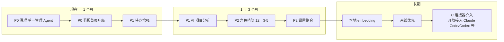

# Seegent 产品定位与功能梳理（讨论结论 + 开发基线）

> 整理日期：2026-07-08
> 整理人：Software 团队（主理人齐活林 + 产品经理许清楚 + 架构师高见远）
> 性质：讨论结论文档（非开发产出，未改动任何代码）
> 依据：主 PRD v1.0（Seegent-PRD.md，2026-07-02）、已归档 v0.1（Seegent-多智能体平台-PRD.md）、实际代码核查、用户拍板决策

---

## 1. 产品定位结论

**Seegent = 独立开发者的项目管理指挥部（A）+ 未来轻量外部执行器连接（C）；明确拒绝多智能体平台路线（B）。**

- **指挥部（A）**：看数据、管待办、分配任务、验收产出。内置 AI 仅做"管项目"类工作（分析/总结/理待办/周报），不写代码、不做图、不跑自动化。
- **轻连接（C，未来方向）**：以最轻量方式把任务派发给外部执行器（WorkBuddy / Claude Code / Codex 等任意执行器）并回收产物；Seegent 内部不注册、不编排 Agent。设计保持开放，优先以 MCP server 方式接入，不限定特定执行器。
- **拒绝（B）**：多智能体平台（Agent 注册表 / invoke_agent 编排 / DAG）。理由：
  1. 主 PRD v1.0 已明确将多 Agent 编排列为非目标，当前形态就是指挥部；
  2. 多 Agent 编排对技术小白成本高，与"多项目一眼看清"的刚需不匹配。
  - ⚠️ 注：此前讨论曾以"PartnerFM 占多智能体坑位、撞车"作为拒 B 理由，但用户 2026-07-08 澄清 **PartnerFM 早已不存在、Seegent 本身就是基于 PartnerFM 改造而来**，该理由作废，改用上述两条。v0.1 多智能体残留实为 Seegent 自家前身代码。

---

## 2. 关键事实发现（影响定位落地）

架构师高见远核查实际代码，发现 v0.1 多智能体能力**未清理，仍活跃于生产代码**，与 v1.0 定位直接冲突：

| 残留项 | 位置 | 状态 |
|--------|------|------|
| invoke_agent 嵌套编排（定义） | server.py:4795 | 活动 |
| invoke_agent 执行体 | server.py:5140–5392 | 活动 |
| run_shell 终端 | server.py:4824（default-general 白名单含它） | 活动 |
| Agent 注册表 | .seegent-agents.json（5 个 active）/api/agents | 活动 |
| 前端多 Agent SSE 渲染 | index.html:12341–12441 | 活动 |

结论：文档（v0.1）已归档，代码未归档。方向在代码层"说一套做一套"。必须在 C 落地前清理（见 §3 P0 前置）。

---

## 3. 功能清单（基于 A+C 定位，按优先级）

### P0 前置（必须先做，否则方向自相矛盾）
- **清理 v0.1 多智能体残留**：删 invoke_agent、run_shell、Agent 注册表、前端多 Agent UI；收敛为单一管理 Agent。
- 验收：仓库内无 invoke_agent / run_shell / Agent 注册表可调用入口；前端无多 Agent 编排 UI；仅存单一管理型 Agent。

### P0
- **看板首页升级**：打开即见所有项目状态 + 待办 + 最近活动。落实"指挥部每天第一站"。
- 验收：首页聚合项目卡片（复用看板 V1 + 飞书数据源）+ 待办摘要 + 最近活动流；开箱即用。

### P1
- **待办管理增强**：自动扫描 TODO 聚合 + 完成态持久化。
- 验收：扫描绑定文件夹 TODO 标记聚合；完成态落盘不重置；与看板首页打通。
- **AI 项目分析**：自动生成趋势 / 周报（需补"时间窗聚合"能力）。
- 验收：基于项目数据 / 活动生成趋势与周报；AI 仅分析总结，不写代码不做图。

### P2
- **角色精简（12→3-5）**：收敛臃肿角色到高频管理角色，降技术小白认知负荷。
- **设置整合**：分散设置收拢统一入口；API Key 自管 / 隐私设置可见明确。

### 明确不做（结合已确认定位）
| 不做项 | 理由 |
|--------|------|
| B 多智能体平台（注册 / DAG / 编排） | 主 PRD 已定位于指挥部，且多 Agent 编排成本高、不匹配刚需 |
| C 连接器本期 | 已确认本期先不做，列为长期方向（接口保持开放） |
| Shell / 终端 | 主 PRD 非目标；清理含删 run_shell |
| Agent 市场 / 社区 | 主 PRD 非目标 |
| 自动路由 / 意图识别 | 主 PRD 非目标 |
| 社交媒体数据监测 | 主 PRD 非目标；用户已有独立数据监测网站 |

---

## 4. 路线图

---

## 5. 用户拍板决策（2026-07-08）

1. 定位 = A+C，拒绝 B（拒 B 理由已修正，见 §1 注）
2. v0.1 残留 = 代码清理（收敛单一管理 Agent）
3. 连接器 C = 本期先不做（长期方向保持开放，可接 Claude Code / Codex 等任意执行器）
4. 最小价值点 = 看板首页（状态 + 待办 + 最近活动）最优先
5. 隐私优先级 = 多项目一眼看清更重要（隐私是加分项）
6. 小白友好度 = 最好开箱即用，可接受一定本地维护（分级）
7. 待确认问题（未来执行器接入范围）= 未来可能连接 Claude Code、Codex 等任意外部执行器，都有可能；设计保持开放

---

## 6. 开发状态

- 2026-07-08 用户确认"维持 A+C，进入开发状态"。
- 首个开发迭代范围：**P0 前置清理 + P0 看板首页升级**（据路线图 now→1 月）。
- 开发流程：标准 SOP（PRD → 架构设计+任务分解 → 工程师实现 → QA 测试）。

---

## 7. 备注

- 本文档为讨论结论 + 开发基线，未改动任何代码。
- 后续若启动开发，以本清单为输入走标准 SOP。
- 现有主 PRD v1.0 的定位章节如需同步，可据此更新（本次未改）。
