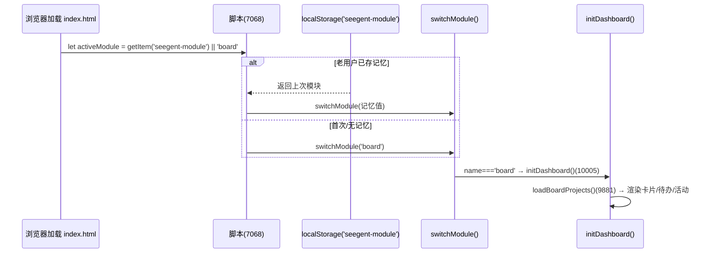
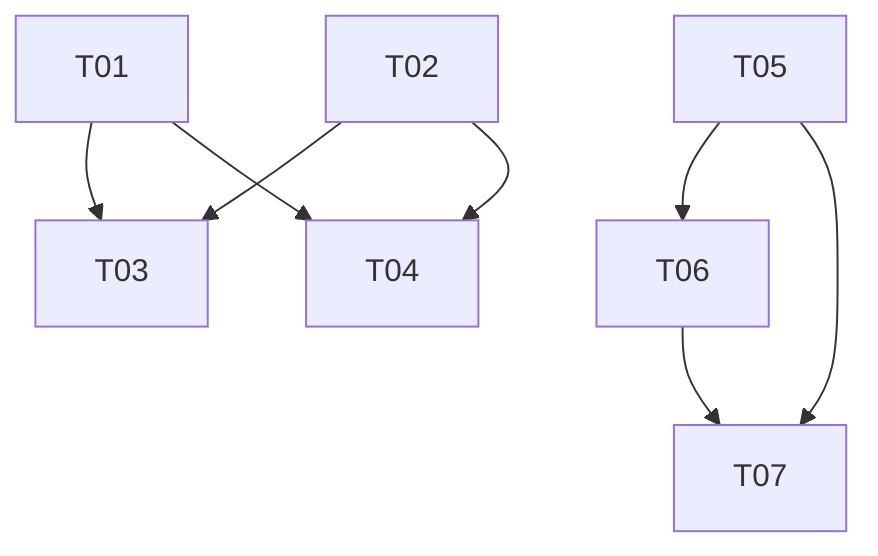

# Seegent 增量迭代 v1.1 — 系统设计 + 任务分解

> 架构师：高见远（Gao）｜基线：PRD v1.1（2026-07-08）
> 方法：已实际 Read/Grep 核对 `seegent/server.py`(5826 行)、`seegent/static/index.html`(13089 行)、`.seegent-agents.json`
> 说明：未改动任何文件，仅做设计与任务分解；所有行号均来自本次实际核查。

## 0. 核查结论摘要（PRD 行号 vs 实际）

| PRD 引用 | PRD 行号 | 实际核查 | 结论 |
|---|---|---|---|
| `invoke_agent` 定义 | server.py:4795 | server.py:**4795**（dict 跨度 4792–4820） | 准确 |
| `invoke_agent` 执行体 | server.py:5140–5392 | server.py:**5140–5420** | 实际到 5420 |
| `run_shell` 定义 | server.py:4824 | server.py:**4824**（dict 跨度 4821–4835） | 准确 |
| `/api/agents` | server.py | GET **2309–2310**、POST **2507–2508** | 准确 |
| `_agent_loop` | server.py:4600 | server.py:**4600**（agent_id 分支 4624–4634） | 准确 |
| 前端多 Agent SSE 渲染 | index.html:12341–12441 | index.html:**12341–12451** | 实际到 12451 |
| `activeModule` 默认 | index.html:~6920 | index.html:**7068** | 差 148 行 |
| `initDashboard` | index.html:~6963 | index.html:**10005** | 差 3042 行 |
| `loadBoardProjects` | index.html:~9109 | index.html:**9881** | 差 772 行 |
| `renderBoardProjects` | index.html:~9128 | index.html：**9900** | 差 772 行 |
| `#board-module` 模板 | index.html:~2904 | index.html:**3014** | 差 110 行 |

**重要布局澄清**：实际代码位于 `seegent/` 子包（`seegent/server.py`、`seegent/static/index.html`）；仓库根 `server.py` 仅 210 字节兼容入口（`from seegent.server import run_server`），**切勿改动**。`.seegent-agents.json` 在仓库根。

## 1. 实现方案 + 框架选型

- 后端：Python 标准库 `http.server` + 手写 SSE，无 Web 框架、无第三方包。
- 前端：单文件 `seegent/static/index.html` + 原生 JS，无构建步骤。
- **本迭代零新增依赖**，仅删减/重组既有代码。

**清理后 `_agent_loop` 工具集变化**（server.py:4644 `tools = [...]`）
- 移除：`invoke_agent`（定义 4792–4820 / 执行 5140–5420）、`run_shell`（定义 4821–4835 / 执行 5422–5468）。
- 保留：`list_dir`、`read_file`、`write_file`、`edit_file`、`search_files`、`semantic_search`、`web_search`、`web_fetch`、`file_stats`、`recent_files`；MCP 工具仍动态注入（4838+）。
- 收敛：删除 `agent_id` 分支（原 4624–4634），`_agent_loop` 始终以单一默认管理 Agent 运行。

**看板前端重组思路**
- `#board-module`（3014–3033）内重组为三区：项目卡片（`#dash-projects`，已有）、待办汇总（新增）、最近活动（新增）。
- 复用 `GET /api/board/projects` + `GET /api/file-changes`（现有，不改后端）。

## 2. 文件列表及相对路径（改动性质，均相对仓库根）

| 相对路径 | 改动性质 | 本迭代动作 |
|---|---|---|
| `seegent/server.py` | 改 | 删 invoke_agent/run_shell 定义+执行体、删 /api/agents、删 DEFAULT_AGENTS/AGENTS_FILE、收敛 _agent_loop、清理 /api/agent-config 与 base_prompt、删 /api/project-agents + PROJECT_AGENTS_FILE |
| `seegent/static/index.html` | 改 | 删多 Agent SSE 渲染(12341–12451)、删 Agent 注册表 UI、改默认模块为 board、增看板三区与空状态 |
| `.seegent-agents.json`（仓库根） | 删 | 删除 Agent 注册表文件 |
| `.seegent-project-agents.json`（仓库根） | 删 | 删除项目 Agent 孤儿文件 |
| `server.py`（仓库根，210B shim） | 不改 | 仅兼容入口，勿动 |

## 3. 数据结构 / 接口

### 3.1 `GET /api/board/projects`（现有，server.py:3584 `_handle_board_projects_get`）
```
{ "projects": [
    { "folderId", "folderName", "path", "todoFile", "readme", "readmeFile",
      "boundAt", "todos": [ {"text","line","file"} ], "fileCount" }
] }
```
**无 `fileTree` 字段**（PRD 假设不成立）。`todos[]` 与 `fileCount` 足以支撑 R1-2/R1-3。

### 3.2 `GET /api/file-changes`（现有，server.py:2285–2289）
```
GET /api/file-changes?workspace=<path> → { "changes": { "<rel_path>": <mtime_ts> } }
```
前端已在 `index.html:5187` 用于文件模块「最近变更」。**R1-4 直接复用此接口**（按项目 path 聚合取 mtime 最新 5 条）。

### 3.3 收敛后 `_agent_loop`
- `req['agentId']` 不再使用（4624–4634 删除）；始终单一管理 Agent。
- `tools` 列表不再含 `invoke_agent`/`run_shell`。

## 4. 程序调用流程

### 4.1 清理后 `_agent_loop` 工具注册
```
_agent_loop(4600)
  ├─ 删除 agent_id 分支(原4624–4634)
  ├─ tools = [...](4644)
  │     ├─ 删除 invoke_agent (4792–4820)
  │     ├─ 删除 run_shell   (4821–4835)
  │     └─ 保留其余 + 动态 MCP(4838+)
  └─ 工具执行 if/elif 链
        ├─ 删除 elif name=='invoke_agent'(5140–5420)
        ├─ 删除 elif name=='run_shell'(5422–5468)
        └─ 其余 elif + else 保留
```

### 4.2 看板默认态切换（activeModule 决策）


## 5. 任务列表（有序、含依赖）

| ID | 任务 | 对应需求 | 文件 / 估计改动 | 依赖 |
|---|---|---|---|---|
| T01 | 后端：移除 invoke_agent 与 run_shell 定义+执行体 | R0-1,R0-2 | server.py 删定义 4792–4835、执行体 5140–5468 | 无 |
| T02 | 后端：删除 Agent 注册表与 /api/agents | R0-3 | server.py 删 DEFAULT_AGENTS(512–683)、AGENTS_FILE 引用、/api/agents GET/POST；删 .seegent-agents.json；删 /api/project-agents(2510)+PROJECT_AGENTS_FILE | 无 |
| T03 | 后端：收敛 _agent_loop 为单一管理 Agent + 清理 agent-config | R0-5,R0-2 | server.py 删 agent_id 分支(4624–4634)；改 /api/agent-config(2302–2308)；重写 base_prompt(5500) | T01,T02 |
| T04 | 前端：移除多 Agent SSE 渲染 + Agent 注册表 UI | R0-4,R0-3,R0-5 | index.html 删 SSE 12341–12451；删 agentConfig UI；删 /api/agents 拉取(7759)；中和 openAnalysisModal 守卫(10780–10782)与选择器(10794/10813/10847–10851)；移除 chat-agent-select | T01,T02 |
| T05 | 前端：看板设为默认首页 | R1-1 | index.html 7068 `||'file'`→`'board'`；2893/2908 高亮改到 board | 无 |
| T06 | 前端：看板项目卡片增强 | R1-2,R1-3 | index.html renderBoardProjects(9900–9971) 增指标/待办徽章/最后活动时间/操作按钮；CSS 复用 .dash-project-card(2151) | T05 |
| T07 | 前端：待办汇总区 + 最近活动流 + 空状态 | R1-3,R1-4,R1-5 | index.html #board-module(3014) 增待办摘要区、最近活动区(调 /api/file-changes)、空状态 | T05,T06 |

### 依赖图


## 6. 依赖包列表
**无新增依赖。**

## 7. 共享知识（跨文件约定）
- activeModule 默认逻辑：`index.html:7068`；初始高亮 2893(顶栏)、2908(module-content)，需同步改 board。记忆键 `seegent-module`。
- `_agent_loop` 工具注册：`server.py:4644`；MCP 动态注入 4838+。
- 看板渲染：`loadBoardProjects`(9881) → `renderBoardProjects`(9900)；`initDashboard`(10005)。
- CSS 变量体系：`--bg-primary`/`--bg-card`/`--border`/`--accent`/`--text-secondary`；卡片 `.dash-project-card`(2151)。新增样式复用，禁硬编码。
- 模块数量：实际 7 分段 + 对话面板，本次不增删。
- 跨文件耦合：`AGENTS_FILE`/`DEFAULT_AGENTS`/`/api/agents` 在 server.py 与 index.html 多处互引；删后端须同步删前端调用。
- `.seegent-roles.json` 不在本迭代范围，勿动。

## 8. 待明确事项 / 主理人拍板

1. **R1-4 数据源**：改用 `GET /api/file-changes`（无 fileTree）。✅ 采纳
2. **模块数**：只翻默认，不增删。✅ 采纳
3. **回滚**：git commit + tag `pre-cleanup-v0.1`，无生产开关。✅ 采纳（先备份再操作）
4. **openAnalysisModal 失效风险**：纳入 T04 清理，去掉守卫与选择器改用单一默认 Agent。✅ 已含
5. **PROJECT_AGENTS_FILE / /api/project-agents**：一并移除（孤儿）。✅ 采纳
6. **连接器教程文案（server.py:135/141/147 提 run_shell）**：延后到连接器迭代，本期不动。✅ 延后
7. **base_prompt(5500) 必须重写**：T03 已覆盖。✅
8. **行号偏差**：以来源标注为准，工程师实现前 re-confirm。✅
